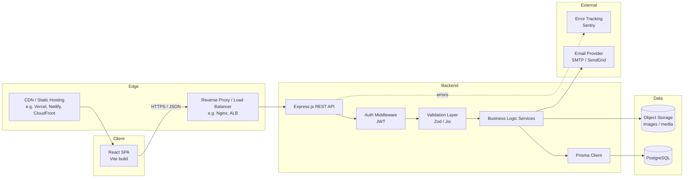

# Technical Architecture Document
## Yatra Bharat — Indian Travel & Tourism Platform

## 1. Overview
Yatra Bharat is built as a classic three-tier web application: a React single-page application (SPA)
for the frontend, a Node.js/Express REST API for the backend, and a PostgreSQL database accessed
through Prisma ORM. The system is designed to be simple to operate at launch and to scale
horizontally as traffic grows.

## 2. High-Level Architecture



## 3. Frontend Architecture (React)

### 3.1 Principles
- **SPA with client-side routing** using React Router; each route (`/`, `/destinations`,
  `/destinations/:slug`, `/plans`, `/plans/:slug`, `/contact`) maps to a page-level component.
- **Component layering:**
  - `pages/` — route-level components that fetch data and compose sections.
  - `components/` — reusable presentational components (Card, SearchBar, Nav, Footer, PlanTimeline).
  - `features/` — feature-scoped logic (e.g. `search/`, `enquiry/`) bundling hooks + components.
  - `lib/api/` — a thin typed API client wrapping `fetch`/`axios` calls to the backend.
  - `hooks/` — cross-cutting hooks (`useDebouncedValue`, `useMediaQuery`, `useReducedMotion`).
- **State management:** local component state and React Query (TanStack Query) for server-state
  (fetching, caching, and revalidating destinations/plans). Lightweight global UI state (e.g. active
  filters) via React Context; no Redux needed at this scale.
- **Styling:** CSS Modules (or Tailwind, team preference) driven by a small design-token file (colors,
  spacing, type scale) so the heritage visual identity stays consistent.
- **Animation:** CSS keyframes/transitions for the primary hero moment and interaction feedback;
  Framer Motion may be introduced later for more complex, state-driven transitions. All motion
  respects `prefers-reduced-motion`.

### 3.2 Indicative Folder Structure
```
frontend/
  src/
    pages/
      Home.jsx
      Destinations.jsx
      DestinationDetail.jsx
      Plans.jsx
      PlanDetail.jsx
      Contact.jsx
    components/
      Nav.jsx
      Footer.jsx
      DestinationCard.jsx
      PlanCard.jsx
      SearchBar.jsx
    features/
      search/
      enquiry/
    lib/
      api/
        client.js
        destinations.js
        plans.js
        enquiries.js
    hooks/
    styles/
      tokens.css
    App.jsx
    main.jsx
  index.html
  vite.config.js
```

## 4. Backend Architecture (Node.js + Express)

### 4.1 Layered design
```
routes        → HTTP verbs + paths, request/response shape only
  ↓
controllers   → orchestrate: parse input, call services, shape response
  ↓
services      → business logic (search ranking, itinerary assembly, enquiry handling)
  ↓
repositories  → Prisma queries only (no business logic here)
  ↓
Prisma Client → PostgreSQL
```
This separation keeps HTTP concerns, business rules, and data access independently testable.

### 4.2 Indicative Folder Structure
```
backend/
  src/
    routes/
      destinations.routes.js
      plans.routes.js
      enquiries.routes.js
      auth.routes.js
    controllers/
    services/
    repositories/
    middleware/
      auth.js
      errorHandler.js
      rateLimiter.js
      validate.js
    schemas/            (Zod/Joi validation schemas)
    utils/
    app.js
    server.js
  prisma/
    schema.prisma
    migrations/
  tests/
```

### 4.3 Cross-cutting middleware
- `helmet` for secure HTTP headers.
- `cors` restricted to known frontend origins.
- Centralised `errorHandler` returning a consistent error envelope.
- Request logging (`morgan` or `pino-http`) feeding structured logs.
- Rate limiting on public write endpoints (enquiry, newsletter).

## 5. Database Architecture (PostgreSQL + Prisma)

### 5.1 Core entities
- `Category` — Heritage, Nature, Beach, Mountains, Spiritual, etc.
- `Destination` — name, slug, region/state, category, short/long description, best season, status
  (draft/published), timestamps.
- `DestinationImage` — one-to-many images per destination (URL, alt text, sort order).
- `TravelPlan` — name, slug, duration (days), route summary, indicative price, status.
- `ItineraryDay` — one-to-many, ordered days belonging to a `TravelPlan` (day number, title,
  description).
- `PlanDestination` — join table linking `TravelPlan` to the `Destination`s it covers.
- `Enquiry` — name, email, phone, destination/plan reference (optional), travel dates, party size,
  message, status (new/contacted/closed), timestamps.
- `NewsletterSubscriber` — email, subscribed-at, status.
- `AdminUser` — email, hashed password, role, timestamps (for the content-management API).

### 5.2 Simplified schema (Prisma-style)
```prisma
model Destination {
  id          String   @id @default(cuid())
  name        String
  slug        String   @unique
  region      String
  categoryId  String
  category    Category @relation(fields: [categoryId], references: [id])
  summary     String
  description String
  bestSeason  String?
  status      Status   @default(DRAFT)
  images      DestinationImage[]
  plans       PlanDestination[]
  createdAt   DateTime @default(now())
  updatedAt   DateTime @updatedAt
}

model TravelPlan {
  id            String   @id @default(cuid())
  name          String
  slug          String   @unique
  durationDays  Int
  priceAmount   Decimal
  priceCurrency String   @default("INR")
  status        Status   @default(DRAFT)
  days          ItineraryDay[]
  destinations  PlanDestination[]
  createdAt     DateTime @default(now())
  updatedAt     DateTime @updatedAt
}

model ItineraryDay {
  id           String     @id @default(cuid())
  dayNumber    Int
  title        String
  description  String
  travelPlanId String
  travelPlan   TravelPlan @relation(fields: [travelPlanId], references: [id])
}

model Enquiry {
  id            String   @id @default(cuid())
  name          String
  email         String
  phone         String?
  destinationId String?
  travelPlanId  String?
  travelDates   String?
  partySize     Int?
  message        String?
  status        EnquiryStatus @default(NEW)
  createdAt     DateTime @default(now())
}

enum Status { DRAFT PUBLISHED ARCHIVED }
enum EnquiryStatus { NEW CONTACTED CLOSED }
```

## 6. API Design (representative endpoints)

| Method | Path | Description | Auth |
|---|---|---|---|
| GET | `/api/destinations` | List/search destinations (`?q=`, `?category=`, `?region=`) | Public |
| GET | `/api/destinations/:slug` | Destination detail with images and related plans | Public |
| GET | `/api/plans` | List travel plans | Public |
| GET | `/api/plans/:slug` | Travel plan detail with itinerary days | Public |
| POST | `/api/enquiries` | Submit an enquiry | Public (rate-limited) |
| POST | `/api/newsletter` | Subscribe to newsletter | Public (rate-limited) |
| POST | `/api/auth/login` | Admin login, returns JWT | Public |
| POST | `/api/admin/destinations` | Create destination | Admin |
| PUT | `/api/admin/destinations/:id` | Update destination | Admin |
| DELETE | `/api/admin/destinations/:id` | Delete destination | Admin |
| GET | `/api/admin/enquiries` | List enquiries | Admin |

All list endpoints support pagination (`?page=`, `?pageSize=`) and return a consistent envelope:
`{ data, meta: { page, pageSize, total } }`.

## 7. Data Flow — Destination Search (example)
1. User types in the search box; the frontend debounces input (≈300ms).
2. Frontend calls `GET /api/destinations?q=<query>&category=<category>`.
3. Controller validates query params → service builds a Prisma `where` clause (case-insensitive
   contains match on name/region, plus category filter) → repository executes the query.
4. Service returns published destinations only, mapped to a lean DTO (no internal fields).
5. Frontend renders results; an empty result set renders a helpful empty state rather than a blank grid.

## 8. Environments & Deployment
| Environment | Frontend | Backend | Database |
|---|---|---|---|
| Local | Vite dev server | `nodemon` on Express | Local/dockerised Postgres |
| Staging | Static hosting (preview deploy) | Containerised API (staging instance) | Managed Postgres (staging DB) |
| Production | Static hosting + CDN | Containerised API behind load balancer, ≥2 instances | Managed Postgres (e.g. RDS/Neon/Supabase) with automated backups |

- Frontend is built to static assets (`vite build`) and served from a CDN for low latency.
- Backend runs as a stateless container so it can scale horizontally behind a load balancer.
- Database migrations are applied via `prisma migrate deploy` as part of the deployment pipeline, never
  run manually against production.

## 9. Third-Party Integrations
- **Email:** transactional email provider (SendGrid/SES) for enquiry confirmations and internal
  notifications.
- **Object storage:** S3-compatible storage (or a media CDN) for destination/plan imagery, referenced
  by URL from the database.
- **Error tracking:** Sentry (or similar) on both frontend and backend.
- **Analytics:** privacy-respecting analytics (e.g. Plausible) for traffic and conversion metrics.

## 10. Scalability Considerations
- Stateless API instances allow simple horizontal scaling behind a load balancer.
- Read-heavy traffic (destination/plan browsing) is a good candidate for HTTP caching / CDN caching on
  GET endpoints, and for a Redis cache in front of expensive queries if traffic grows.
- Database indexes on `Destination.slug`, `Destination.categoryId`, `TravelPlan.slug`, and a
  trigram/GIN index on searchable text columns keep search fast as the catalogue grows.
- Image delivery is offloaded to object storage/CDN rather than served by the API.
