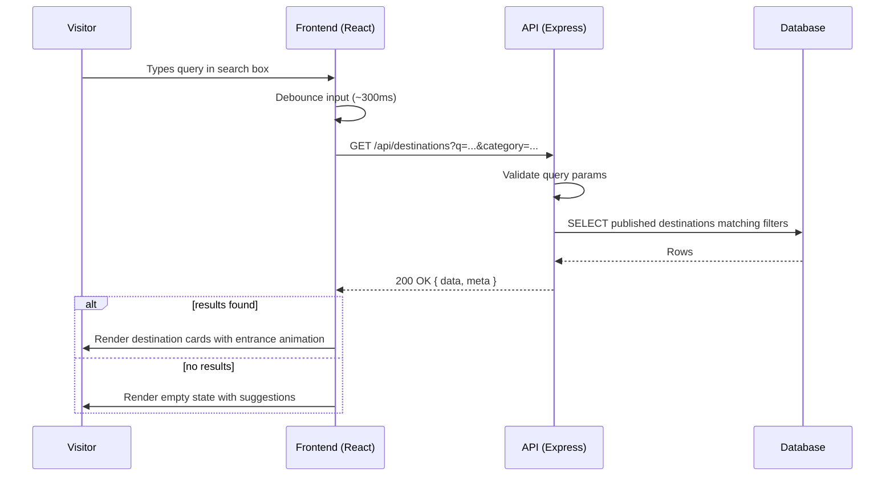
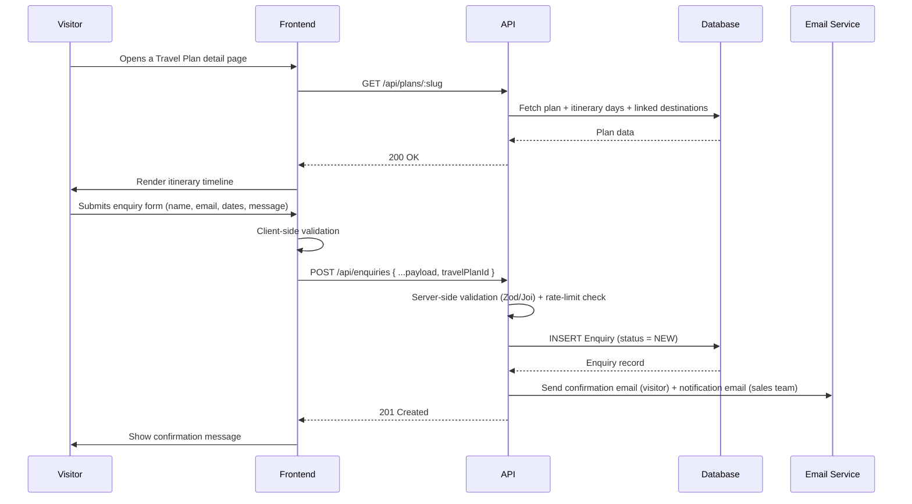
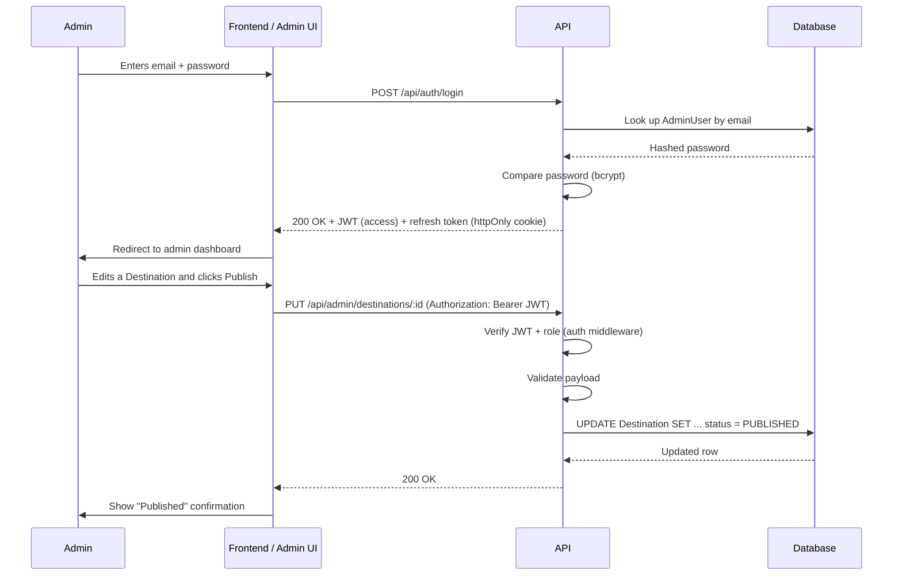
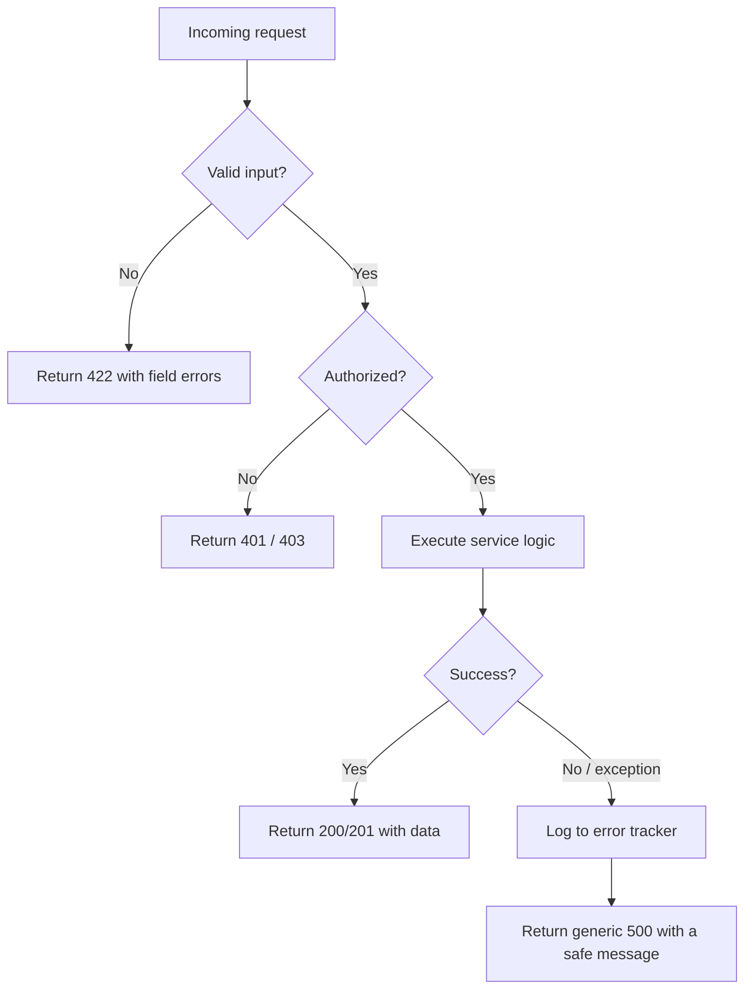
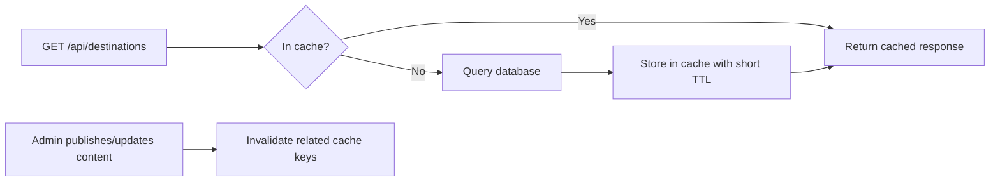

# System Workflow Document
## Yatra Bharat — Indian Travel & Tourism Platform

## 1. Purpose
This document describes how the system behaves end-to-end for the platform's core workflows: search
and discovery, travel-plan browsing, enquiry submission, and admin content management. It complements
the Technical Architecture document by focusing on sequence and behaviour rather than structure.

## 2. Actors
- **Visitor** — an unauthenticated user browsing the public site.
- **Frontend (React SPA)** — runs in the visitor's browser.
- **API (Express)** — the backend service.
- **Database (PostgreSQL via Prisma)**.
- **Email Service** — sends transactional email.
- **Admin** — an authenticated content editor.

## 3. Workflow: Destination Search & Discovery

**Notes**
- Filtering also supports category chips (Heritage, Nature, Beach, Mountains, Spiritual); chip and
  free-text filters combine with logical AND.
- Only destinations with `status = PUBLISHED` are ever returned to public requests.

## 4. Workflow: Travel Plan Browsing → Enquiry

**Failure handling:** if validation fails, the API returns `422` with field-level error messages; the
frontend surfaces these inline without clearing the visitor's already-entered fields. If the email
service is unavailable, the enquiry is still persisted and a background retry (or a queued job) sends
the notification later — enquiry capture must never fail because of an email outage.

## 5. Workflow: Admin Authentication & Content Management

## 6. Data Lifecycle — Destinations & Travel Plans
1. **Create (Draft):** Admin creates a record with `status = DRAFT`. It is never returned by public
   endpoints.
2. **Review:** Content is checked (copy, images, pricing) before publishing.
3. **Publish:** Admin sets `status = PUBLISHED`; it now appears in search, listings, and detail pages.
4. **Update:** Edits to a published record are saved immediately; the frontend always reads current
   data (no caching layer at MVP scale beyond normal HTTP caching).
5. **Archive:** Instead of hard-deleting a destination or plan that has historical enquiries pointing
   to it, admins set `status = ARCHIVED`, which hides it from public listings while preserving
   referential integrity for past enquiries.

## 7. Error-Handling Workflow (API-wide)

The API never leaks stack traces, SQL errors, or internal identifiers to the client; centralised error
middleware maps internal errors to safe, generic responses while full detail goes to server-side logs
and the error tracker.

## 8. Caching Workflow (introduced when traffic warrants it)

Public GET endpoints for destinations and plans are cache-friendly since they change infrequently;
publishing an update invalidates the relevant cache keys so visitors never see stale content for long.
